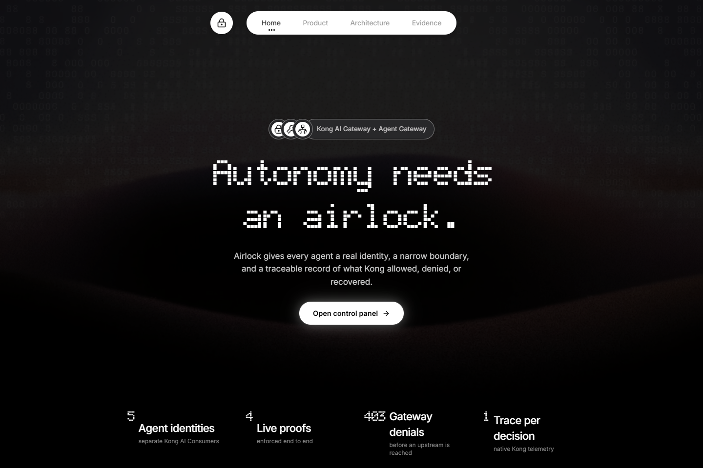
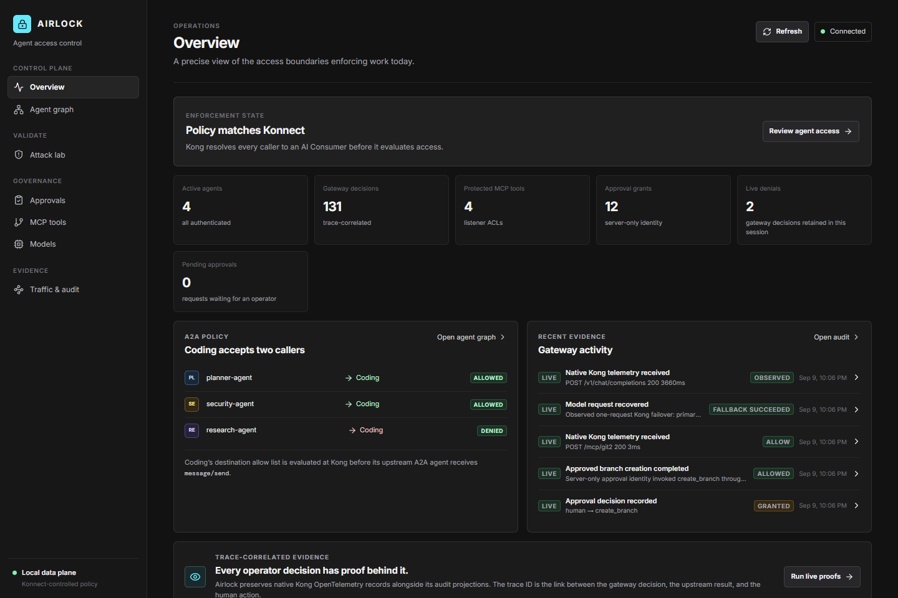
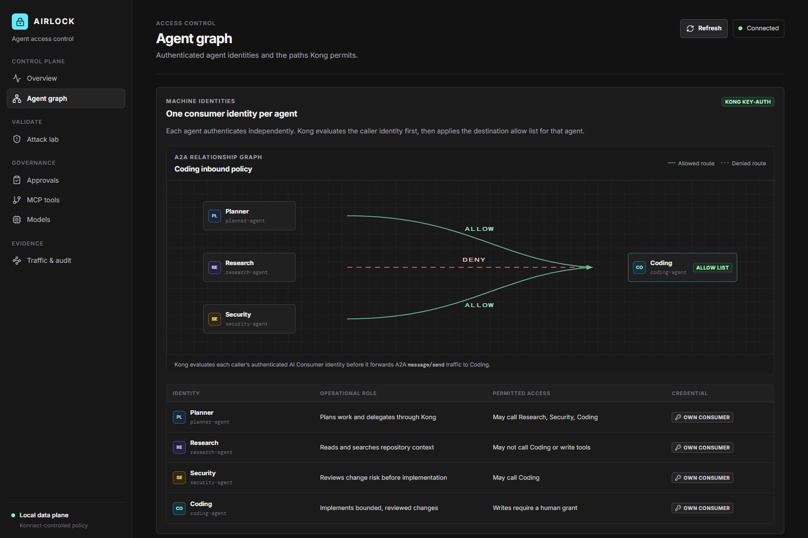
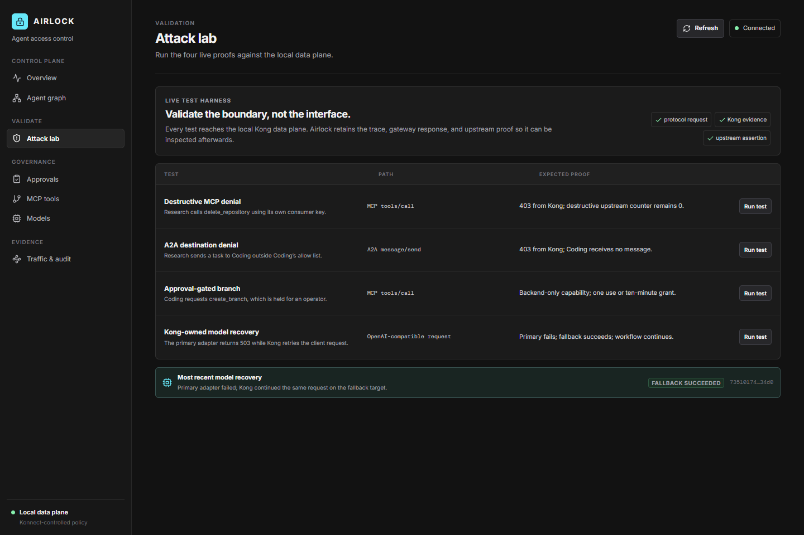
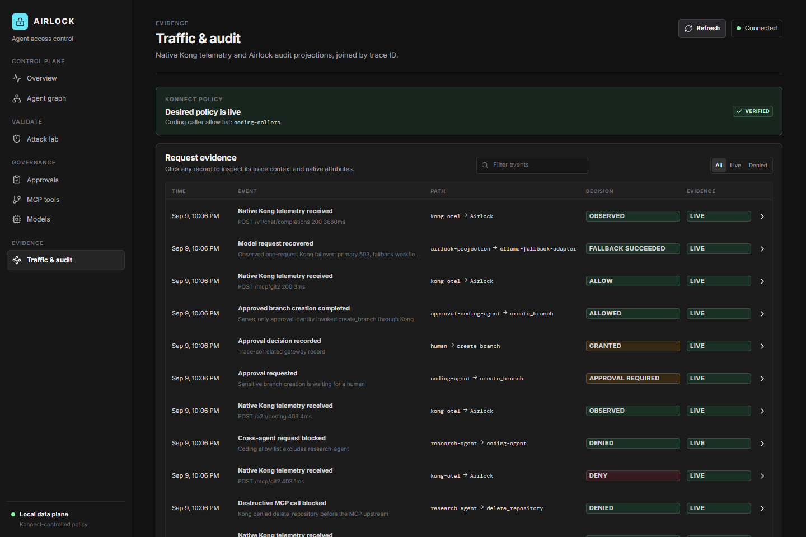

# Airlock

> **Control what autonomous software can access.**

Airlock is a zero-trust control plane for multi-agent software engineering workflows. It gives every agent its own Kong identity, constrains where that identity can communicate and which MCP tools it can invoke, and preserves trace-correlated proof for an operator to review.

Airlock is built for the gap between a useful autonomous workflow and a safe one. The application does not decide whether an agent may reach a sensitive destination, use a destructive tool, or select a fallback model. **Kong does.**

**Built with Kong Konnect, Kong AI Gateway, Agent Gateway capabilities, AI Consumers, AI Auth Strategies, A2A AI Agents, AI MCP Server listeners, and native OpenTelemetry evidence.**

---

## Why Airlock

Autonomous systems are powerful because they can make decisions and take actions. That creates a different security problem from a conventional web application:

- An agent can be redirected to a destructive tool.
- A research agent can attempt to contact an implementation agent it was never meant to reach.
- A normal coding identity can accidentally gain a write capability.
- Application-level fallback logic can hide failed model routing from the gateway.
- A dashboard can claim a request was blocked without proving that its upstream never received it.

Airlock turns each of those concerns into an enforceable gateway boundary and a live, inspectable proof.

## Submission at a glance

| What a judge can verify | How Airlock proves it |
| --- | --- |
| **Distinct agent identity** | Five independent Kong AI Consumers use key-auth; the approval identity remains server-side. |
| **Real MCP enforcement** | Research makes a real MCP JSON-RPC `tools/call(delete_repository)` through Kong and receives `403`. The MCP server counter remains `0`. |
| **Real A2A enforcement** | Research sends A2A JSON-RPC `message/send` to Coding. Kong rejects it before Coding’s upstream handler sees it. |
| **Human approval without a bypass** | A persisted grant lets FastAPI use a narrowly privileged identity once; the request still passes through Kong. |
| **Kong-owned resilience** | Kong retries one failed model request from a primary Ollama adapter to a lower-priority fallback. FastAPI observes the result; it never selects the fallback. |
| **Evidence, not invented telemetry** | Kong emits OpenTelemetry access logs. Airlock ingests them, joins them to the same trace ID, and shows the projection beside the gateway event. |

## Product preview

### Landing page

The entry page explains the product in one view and has one intentional action: open the working control panel.



### Overview: policy, identity, and live evidence

The Overview is an operator’s starting point. It makes the current policy state, active identities, recent gateway evidence, and provenance visible without turning the product into a decorative dashboard.



### Agent graph: enforceable destinations

Coding accepts Planner and Security but not Research. The diagram represents a Kong consumer-group allow list, not a convention in application code.



### Attack Lab: four live proofs

Attack Lab is intentionally narrow. Each action sends traffic through the local Kong data plane and produces trace-correlated evidence in the console.



### Traffic & Audit: source-aware evidence

Every event carries a provenance label. A native Kong telemetry record is not represented as an application-generated event.



---

## Architecture

Konnect provides the configuration surface and manages the local data plane. The application, agents, tools, PostgreSQL, adapters, and observability pipeline remain local on one Docker network: `airlock-net`.

```text
                                  KONNECT CONTROL PLANE
                     AI Gateway entities, policy, configuration, visibility
                                             │
                                  manages local data plane
                                             │
┌──────────────────────────────────────── airlock-net ───────────────────────────────────────┐
│ Browser → Next.js control panel → FastAPI control API                                         │
│                                         │                                                     │
│                                         ▼                                                     │
│                              LOCAL KONG DATA PLANE                                            │
│                  authenticate → authorize → proxy → retry → emit OTEL                         │
│                          ┌──────────────┼───────────────┐                                     │
│                          ▼              ▼               ▼                                     │
│                     AI Model       MCP listener      A2A AI Agents                             │
│                          │              │               │                                     │
│                    Ollama adapters   Git MCP       Planner / Research /                         │
│                          │             server      Security / Coding                            │
│                          └──── host.docker.internal:11434 ─────► Ollama                        │
│                                                                                               │
│ Kong OTLP logs → OpenTelemetry Collector → FastAPI OTLP ingestion → PostgreSQL → SSE → UI    │
└───────────────────────────────────────────────────────────────────────────────────────────────┘
```

### Runtime ownership

| Layer | Responsibility | Runs where |
| --- | --- | --- |
| **Kong Konnect** | AI Gateway entity configuration and management surface | Kong-hosted control plane |
| **Local Kong data plane** | Consumer resolution, ACL evaluation, MCP/A2A/model routing, retry/failover, native telemetry | Local, Konnect-controlled data plane |
| **FastAPI** | Starts demonstrations, owns approval records, ingests OTLP, persists projections, serves SSE | Docker |
| **Next.js** | Landing page and operator UI: Overview, Agent Graph, Attack Lab, Approvals, MCP Tools, Models, Traffic & Audit | Docker |
| **PostgreSQL** | Durable workflow, approval, grant, event-projection, and trace state | Docker |
| **MCP / A2A upstreams** | Instrumented upstreams that prove whether Kong actually forwarded a request | Docker |
| **Ollama** | Local `qwen3:8b` and `qwen2.5-coder:1.5b` model runtime | Windows host via `host.docker.internal` |

## What Kong enforces

### 1. AI Auth Strategy and machine identity

[`kong/airlock.yaml`](kong/airlock.yaml) is the checked-in definition for Airlock’s current Kong AI Gateway entity model. It declares the shared key-auth AI Auth Strategy `airlock-key-auth` and attaches it to every protected resource:

- the `airlock-code-model` AI Model;
- Planner, Research, Security, and Coding A2A AI Agents;
- the Git AI MCP Server listener.

Each caller sends an `apikey`. Kong resolves that key to an AI Consumer **before** it evaluates access controls.

| AI Consumer | Role | Credential location |
| --- | --- | --- |
| `planner-agent` | starts approved work and delegates | Planner runtime only |
| `research-agent` | reads and searches repository context | Research runtime only |
| `security-agent` | assesses risk and can contact Coding | Security runtime only |
| `coding-agent` | performs normal bounded work | Coding runtime only |
| `approval-coding-agent` | makes one approved branch request | **FastAPI only; never browser or agent runtime** |

### 2. A2A destination allow lists

Every upstream A2A agent exposes an Agent Card at `/.well-known/agent-card.json` and accepts A2A JSON-RPC `message/send` requests. Kong exposes those services as A2A AI Agent entities.

Coding has an explicit allow-list Consumer Group called `coding-callers`. Only `planner-agent` and `security-agent` belong to it.

```text
Planner   ───────────── allow ───────► Coding
Security  ───────────── allow ───────► Coding
Research  ─── Kong 403 / denied ─────► Coding upstream receives nothing
```

This is the core A2A claim: Research does not merely receive a polite application error. Kong rejects the request before it reaches Coding.

### 3. Listener-mode MCP policy

Airlock uses an AI MCP Server listener with consumer-based defaults and per-tool ACLs. It uses actual MCP JSON-RPC `tools/call` traffic; there is no invented destructive REST endpoint.

| MCP tool | Consumer policy | Why it matters |
| --- | --- | --- |
| `read_repository` | authenticated consumers | normal repository discovery |
| `search_code` | authenticated consumers | normal repository discovery |
| `create_branch` | `approval-coding-agent` only | normal Coding cannot write without a grant |
| `delete_repository` | `security-agent` only | Research attack is rejected before execution |

The listener preserves upstream tool names. In the destructive demonstration, Research calls `delete_repository`; Kong returns `403`, Airlock records the trace, and the MCP server’s `delete_repository` invocation counter stays at `0`.

### 4. Kong-owned model routing and recovery

Airlock defines one AI Model with two Ollama-backed targets. Priority and retry behavior belong to Kong:

| Target | Adapter | Priority / weight | Model |
| --- | --- | --- | --- |
| Primary | `ollama-primary-adapter` | `100` | `qwen3:8b` |
| Fallback | `ollama-fallback-adapter` | `10` | `qwen2.5-coder:1.5b` |

The model configuration enables priority balancing, one retry, and explicit failure criteria including `http_503` and `non_idempotent`, allowing the failed OpenAI-compatible POST request to be retried appropriately.

```text
FastAPI makes one model request
  → Kong tries qwen3:8b through the primary adapter
  → Attack Lab makes the primary return 503
  → Kong retries on qwen2.5-coder:1.5b through the fallback adapter
  → one client workflow succeeds
```

The adapter services expose only a controlled fault switch and request counters. They make routing evidence visible; they do not decide which model should run.

---

## Four live demonstrations

These are the MVP. The project deliberately avoids padding the submission with partly simulated prompt injection, token exhaustion, rate limiting, or extra agents until these gateway proofs work end-to-end.

### 1. Destructive MCP denial

1. Research sends a real MCP JSON-RPC `tools/call` for `delete_repository` through Kong.
2. Kong resolves Research’s AI Consumer and evaluates the per-tool listener ACL.
3. Kong returns `403`.
4. The `delete_repository` upstream invocation counter remains `0`.
5. Kong emits native telemetry; Airlock saves a trace-correlated audit projection.

**Judge check:** a `403` alone is not the proof. Check the zero upstream counter and matching Kong telemetry record.

### 2. A2A destination denial

1. Research sends an A2A `message/send` request to Coding.
2. Kong authenticates Research, evaluates Coding’s allow list, and rejects the destination.
3. Coding’s received-message counter does not change.
4. The trace appears in Traffic & Audit as gateway evidence plus the Airlock audit projection.

**Judge check:** Planner → Coding succeeds in the smoke suite; Research → Coding fails. The boundary is identity-specific, not a global route block.

### 3. Approval-gated branch creation

1. `coding-agent` requests `create_branch` using an identity that cannot call it.
2. Airlock persists a `PENDING` approval in PostgreSQL.
3. An operator grants **Approve once** or a time-bound capability.
4. FastAPI alone uses `approval-coding-agent` to invoke `create_branch` through Kong.
5. A one-use approval becomes `CONSUMED` after a successful call. A timed grant carries and enforces an expiry.

**Judge check:** the privileged credential is never exposed to the browser and is not handed to the normal coding runtime.

### 4. Kong-owned model failover

1. Attack Lab faults `ollama-primary-adapter` so it returns `503`.
2. The next model request goes to Kong once.
3. Kong retries to `ollama-fallback-adapter`.
4. Counters show primary attempted/failed and fallback attempted/succeeded.
5. The workflow continues without FastAPI choosing a target.

**Judge check:** inspect the two adapter counters and successful response under the same client workflow, not an app-initiated second request.

---

## Evidence and provenance

Airlock does not insert fake Kong events after normal application requests. Kong’s global OpenTelemetry policy sends native access logs to the internal `otel-collector`; the collector forwards them to FastAPI’s OTLP endpoint at `/v1/logs`.

Correlation sequence:

1. Airlock starts a live demonstration with `X-Airlock-Trace-Id`.
2. Kong processes the request, creates its own request context, and exports OTLP evidence.
3. FastAPI ingests that event and joins it with an operator projection by trace ID and, where present, Kong request ID.
4. SSE updates the UI without requiring a browser refresh.

| Label | Meaning |
| --- | --- |
| `LIVE` | generated by a current request, native telemetry record, or operator action |
| `HISTORICAL` | restored from PostgreSQL after a restart |
| `SIMULATION` | non-live data; never presented as Kong-originated proof |

## Demo script for judges

1. Open `http://localhost:3000` and choose **Open control panel**.
2. On **Overview**, inspect the policy state and recent evidence stream.
3. Open **Agent graph**. Show that only Planner and Security have an allowed path to Coding.
4. In **Attack Lab**, run **Destructive MCP denial**. Open the result and then **Traffic & Audit** to show the `403`, trace, and counter evidence.
5. Run **A2A destination denial**. Explain that Coding did not receive the message.
6. Run **Approval-gated branch**, open **Approvals**, and choose **Approve once**. Show the consumed grant and successful privileged request.
7. Run **Kong-owned model recovery**. Show primary failure, fallback success, and workflow continuation.
8. Finish in **Traffic & Audit**, filtering `LIVE` events and opening a record to inspect trace details.

## Local setup

### Prerequisites

- Docker Desktop with Linux containers and Docker Compose v2
- Windows host with [Ollama](https://ollama.com/) running
- `qwen3:8b` and `qwen2.5-coder:1.5b` installed locally
- Kong Konnect account and a local-only personal access token
- `kongctl`
- PowerShell for the smoke suite; WSL is recommended for the Kong quickstart wrapper

### 1. Create local configuration

```powershell
Copy-Item .env.example .env
```

Set `KONNECT_TOKEN`, `KONNECT_AI_GATEWAY_ID`, and five different consumer keys. Never reuse an agent key. `.env`, generated mTLS material, local data-plane credentials, and Konnect bootstrap files are ignored by Git.

### 2. Provision the Konnect-controlled data plane

From WSL:

```bash
export KONNECT_TOKEN='your-local-token'
./scripts/bootstrap-konnect.sh
```

The wrapper follows Kong’s AI Gateway quickstart model: Konnect is the control plane and the data plane is local. It exposes the local proxy on port `18000`.

> `kong/kong.local.yml` is a minimal local UI/API fallback. The four evidence demonstrations require the Konnect-managed definitions in `kong/airlock.yaml`.

### 3. Apply Airlock’s AI Gateway definitions

```powershell
kongctl apply -f kong/airlock.yaml --pat $env:KONNECT_TOKEN --auto-approve
```

Apply the listener-mode MCP rules using [`scripts/create-mcp-passthrough.sh`](scripts/create-mcp-passthrough.sh) where `KONNECT_TOKEN`, `KONNECT_AI_GATEWAY_ID`, and [`kong/mcp-passthrough.json`](kong/mcp-passthrough.json) are available.

### 4. Prepare local models

```powershell
ollama pull qwen3:8b
ollama pull qwen2.5-coder:1.5b
```

The adapters call `host.docker.internal:11434` by default. Override `PRIMARY_OLLAMA_URL` or `FALLBACK_OLLAMA_URL` in `.env` only when necessary.

### 5. Start Airlock

```powershell
docker compose up --build
```

Open:

- Control panel: `http://localhost:3000`
- API health: `http://localhost:8001/health`
- Kong proxy: `http://localhost:18000`

All Docker services are on `airlock-net`; Ollama is the deliberate host-side exception.

## Verification

```powershell
# Start or rebuild the complete local runtime.
docker compose up -d --build

# Backend contract tests.
docker compose exec -T api pytest -q

# Frontend production build.
Push-Location web
npm install
npm run build
Pop-Location

# End-to-end evidence suite.
.\scripts\smoke.ps1
```

The smoke suite verifies:

- Planner → Coding A2A delivery is allowed.
- Research → Coding A2A returns `403` and does not reach Coding.
- Research → `delete_repository` returns `403` and the destructive MCP counter stays `0`.
- One-time branch approval is consumed after the privileged call.
- The primary model attempt fails once, the fallback succeeds once, and the client sees a successful workflow.

## Repository layout

```text
airlock/
├── api/                         FastAPI control API, persistence, SSE, OTLP ingestion
├── docs/assets/                 real README screenshots captured from the running product
├── kong/
│   ├── airlock.yaml             Konnect AI Gateway entities and policy
│   ├── mcp-passthrough.json     listener-mode MCP per-tool ACLs
│   └── kong.local.yml           minimal local-only fallback
├── services/
│   ├── a2a-agent/               Agent Card, A2A JSON-RPC handler, receipt counter
│   ├── mcp-server/              MCP upstream and exact-tool invocation counters
│   └── ollama-adapter/          faultable model adapters and request counters
├── web/                         Next.js landing page and operator console
├── scripts/                     Konnect bootstrap, MCP setup, smoke validation
├── otel-collector-config.yaml   native Kong OTLP pipeline
├── docker-compose.yml           complete local runtime on airlock-net
└── videos/                      demo source; generated renders remain local-only
```

## Security boundaries and limitations

- Do not commit a Konnect PAT, consumer credential, `.env`, generated data-plane material, or local bootstrap output.
- The `approval-coding-agent` credential is server-side. A successful UI action is not a browser-side permission bypass.
- The current deployment is a local-first hackathon implementation. A production rollout would require managed secret storage, hardened network policy, a durable OTLP collector, production identity lifecycle controls, and a production model runtime.
- Airlock does not treat seeded, historical, or simulated events as live Kong evidence. The visible provenance label is part of the product’s trust model.
- Scope is intentionally frozen around four complete gateway demonstrations. Prompt injection, token exhaustion, rate limiting, and additional agents are deferred rather than represented with partial simulations.

## The central idea

An agent should not be trusted merely because the app calls it Research, Coding, or Security. Airlock makes that role concrete at the gateway: an authenticated consumer identity, an explicit route and tool boundary, a constrained approval path, and evidence that the boundary held.
